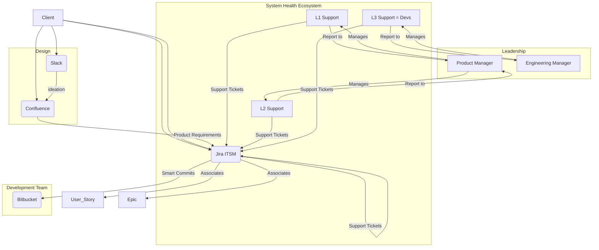

```mermaid

graph TD
  subgraph "System Health Ecosystem" 
    L1[L1 Support]
    L2[L2 Support]
    L3[L3 Support = Devs]
    Jira(Jira ITSM)
  end

  subgraph "Design"
    Slack(Slack)
    Confluence(Confluence)
  end

  subgraph "Development Team"
    Bitbucket(Bitbucket)
 
  end


  subgraph "Leadership"
    PM[Product Manager]
    EM[Engineering Manager]
  end

  Client["Client"]

  Client --> Slack
  Client --> Confluence
  Client --> Jira
  Client --> Jira

  Slack -->|ideation| Confluence
  Confluence -->|Product Requirements| Jira
  Jira -->|Support Tickets| Jira

  L1 -->|Support Tickets| Jira
  L2 -->|Support Tickets| Jira
  L3 -->|Support Tickets| Jira

  L1 -->|Report to| PM
  L2 -->|Report to| PM
  L3 -->|Report to| EM

  PM -->|Manages| L1
  PM -->|Manages| L2
  EM -->|Manages| L3

  Jira -->|Smart Commits| Bitbucket
  Jira -->|Associates| User_Story
  Jira -->|Associates| Epic


```
