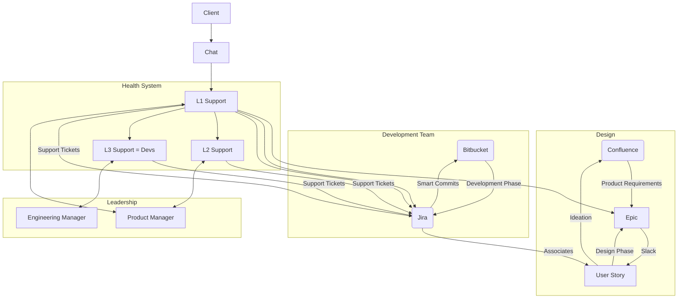

# This is a plan for Comp_A to achieve an enterprise-level of organization.

```mermaid 
graph TD
  subgraph "Leadership"
    PM[Product Manager]
    EM[Engineering Manager]
  end

  subgraph "Design"
    
    Confluence(Confluence)
    User_Story["User Story"]
    Epic[Epic]
  end

  subgraph "Development Team"
    Bitbucket(Bitbucket)
    Jira( Bitbuket Jira)
  end

subgraph "Health System"
    L1[L1 Support]
    Jira(Jira ITSM)
    L2[L2 Support]
    L3[L3 Support = Devs]
  end
  
  Client["Client"]
  

  Client --> Chat
  Chat --> L1
  L1 --> Epic
  L1 --> Jira
  L1 --> Jira
  L1 --> L2
  L1 --> L3

  
  Epic -->|Slack| User_Story
  User_Story -->|Ideation| Confluence
   -->|Product Requirements | Epic
  
  L1 -->|Support Tickets| Jira
  L2 -->|Support Tickets| Jira
  L3 -->|Support Tickets| Jira

  L1 <--> PM
  L2 <-->  PM
  L3 <--> EM


  Jira -->|Smart Commits| Bitbucket
  Bitbucket -->|Development Phase| Jira(Jira)
  Jira(Jira) -->|Associates| User_Story
  User_Story -->|Design Phase| Epic


```
