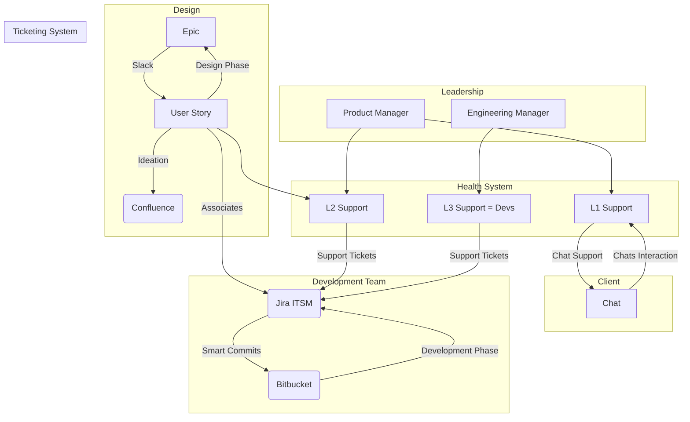

```mermaid
graph TD


  subgraph "Health System"
    L1[L1 Support]
    L2[L2 Support]
    L3[L3 Support = Devs]
  end

  subgraph "Leadership"
    PM[Product Manager]
    EM[Engineering Manager]
  end

  subgraph "Client"
    Chat[Chat]
  end

  subgraph "Development Team" 
    L2[L2 Support]
    Bitbucket(Bitbucket)
    Jira(Jira ITSM)
  end

  Epic -->|Slack| User_Story
  User_Story -->|Ideation| Confluence
  User_Story -->|Associates| Jira
  User_Story -->|Design Phase| Epic

  subgraph "Design" 
    
    Confluence(Confluence)
    User_Story["User Story"]
    Epic[Epic]
  end

  subgraph "Ticketing System"
    Jira
  end


  PM --> L2
  PM --> L1
  EM --> L3

  L1 -->|Chat Support| Chat
  Chat -->|Chats Interaction| L1

  User_Story --> L2
  L2 -->|Support Tickets| Jira
  L3 -->|Support Tickets| Jira

  Jira -->|Smart Commits| Bitbucket
  Bitbucket -->|Development Phase| Jira


```
